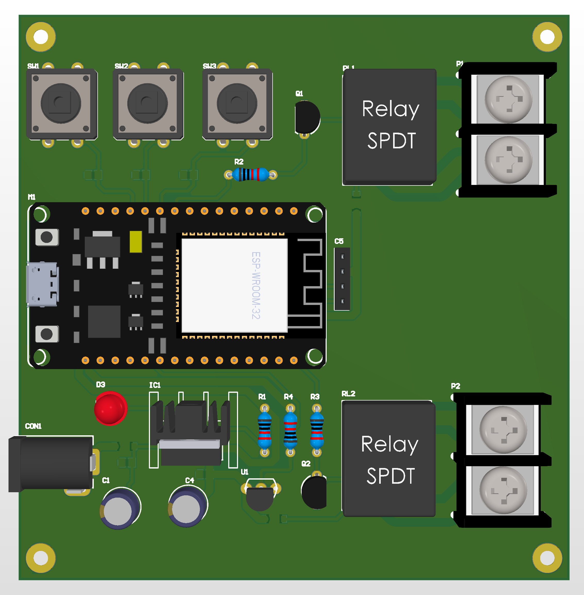

# Smart Thermostat Controller

Wi-Fi enabled thermostat board.

## Function
Temperature control with IoT support.

## Key Specifications
- MCU: ESP32-WROOM-32
- Sensor: DS18B20
- HMI: I2C LCD + buttons
- Output: 2 relays

## Hardware Preview

---
Designed by HOANG LE TRUNG KIEN
