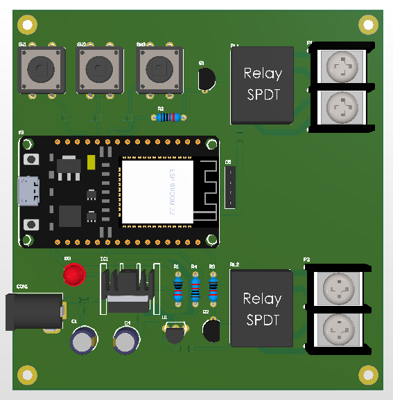

# ESP32 Smart Thermostat Controller

A versatile IoT development board for the ESP32-DevKit-V1, designed for smart home temperature control with relay outputs, sensor interface, and a local HMI.

## Functions
*   **Temperature Monitoring:** Interfaces with the DS18B20 digital sensor for precise temperature readings.
*   **Dual-Channel Control:** Two 5V SPDT Relays for controlling heating (Heater) and cooling (Fan/Quat) elements independently.
*   **User Interface:**
    *   **Display:** I2C header for OLED/LCD screens to show real-time status.
    *   **Input:** 3 tactile buttons (SET, UP, DOWN) for manual configuration of setpoints.
*   **Remote Management:** Leverages the ESP32's WiFi/Bluetooth capabilities for app-based control (e.g., Blynk, Home Assistant).

## Technical Highlights (Design Evaluation)

This carrier board transforms the ESP32 module into a deployment-ready controller:

*   **Robust Power Stage:**
    *   **LM7805 Regulator:** Steps down 9V DC input to a clean 5V rail for the relays and ESP32, ensuring stability even if the input fluctuates.
    *   **Reverse Protection:** Diode **D1 (1N4007)** protects the system from accidental reverse polarity at the DC jack.
*   **Noise Filtering:** Extensive decoupling (100nF capacitors C2, C3, C6-C8) is placed at the regulator output and switch inputs to prevent "ghost" button presses and processor resets caused by relay switching noise.
*   **Safe Relay Driving:**
    *   **Transistor Isolation:** NPN transistors (C1815) act as switches for the relays, protecting the 3.3V ESP32 GPIOs from the 5V relay coils.
    *   **Flyback Diodes:** D2 and D4 clamp inductive spikes from the relay coils to protect the transistors.

## Specifications
*   **Core Module:** ESP32-DEVKIT-V1 (30-pin version).
*   **Input Voltage:** 9V DC (via DC Jack).
*   **Outputs:** 2x Relays (Heater/Cooler Control).
*   **Sensor:** DS18B20 (1-Wire Protocol).
*   **Display:** I2C Interface (SDA/SCL).

## Pinout
| Header | Description |
| :--- | :--- |
| **CON1** | 9V Power Input |
| **P1 (QUAT)** | Fan/Cooler Relay Output |
| **P2 (DEN)** | Light/Heater Relay Output |
| **SENSOR** | Header for DS18B20 |
| **LCD** | I2C Display Header |
